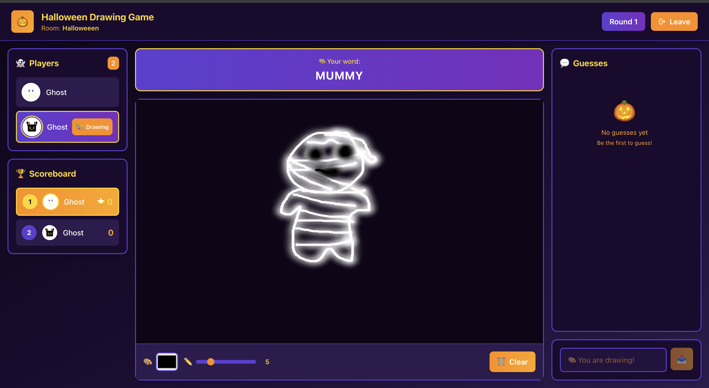

# Drawing Game




A real-time multiplayer drawing and guessing game built with WebSockets, similar to Gartic Phone/Skribbl.io. Halloween themed!

## Quick Start

### Prerequisites
- Node.js 20+ (`nvm use 20`)

### Setup & Run

```bash
# Terminal 1 - Start the server
cd server
npm install
npm run dev
```

```bash
# Terminal 2 - Start the client
cd drawing-game-client
npm install
npm start
```

Open http://localhost:4200 in your browser. Open multiple tabs/browsers to play with yourself or share the room ID with friends!

## Features

- Real-time multiplayer gameplay via WebSockets
- Automatic game start when 2+ players join
- Fair drawer rotation system
- Time-based scoring (earlier correct guesses earn more points)
- Room-based isolation (multiple games can run simultaneously)
- Session persistence (refresh page to reconnect)
- 60+ Halloween-themed prompt words
- 12 spooky avatars

## Tech Stack

| Layer | Technologies |
|-------|-------------|
| **Server** | Node.js, Express, WebSockets (ws), TypeScript |
| **Client** | Angular 17, RxJS, HTML5 Canvas, Tailwind CSS |

## Endpoints

| Endpoint | Description |
|----------|-------------|
| `http://localhost:4200` | Web client |
| `ws://localhost:3000` | WebSocket server |
| `http://localhost:3000/health` | Health check |
| `http://localhost:3000/rooms` | List active rooms |

## WebSocket Protocol

### Client → Server Messages

**Join Room:**
```json
{
  "type": "join",
  "roomId": "room-123",
  "playerName": "Alice"
}
```

**Draw Stroke:**
```json
{
  "type": "draw",
  "stroke": {
    "type": "line",
    "points": [{"x": 10, "y": 20}, {"x": 15, "y": 25}],
    "color": "#000000",
    "brushSize": 5,
    "timestamp": 1234567890
  }
}
```

**Submit Guess:**
```json
{
  "type": "guess",
  "guess": "elephant"
}
```

**Tool Change:**
```json
{
  "type": "tool_change",
  "color": "#FF0000",
  "brushSize": 10
}
```

**Clear Canvas:**
```json
{
  "type": "clear_canvas"
}
```

### Server → Client Messages

**Player Joined:**
```json
{
  "type": "player_joined",
  "player": {...},
  "players": [...],
  "timestamp": 1234567890
}
```

**Round Start:**
```json
{
  "type": "round_start",
  "roundNumber": 1,
  "isDrawer": true,
  "prompt": "elephant",
  "drawerId": "player-id",
  "timestamp": 1234567890
}
```

**Guess:**
```json
{
  "type": "guess",
  "playerId": "player-id",
  "playerName": "Alice",
  "guess": "elephant",
  "timestamp": 1234567890
}
```

**Score Update:**
```json
{
  "type": "score_update",
  "scores": {
    "player-id-1": 1500,
    "player-id-2": 800
  },
  "timestamp": 1234567890
}
```

## Game Configuration

Default configuration (in `server/src/config.ts`):
- Minimum players: 2
- Maximum players: 8
- Round duration: 60 seconds
- Intermission duration: 5 seconds
- Total rounds: 3
- 60+ prompt words

## Project Structure

```
server/
├── src/
│   ├── models/
│   │   └── types.ts          # TypeScript interfaces and types
│   ├── services/
│   │   ├── GameRoom.ts       # Game room logic
│   │   ├── GameRoomManager.ts # Room management
│   │   ├── ScoringEngine.ts  # Scoring calculations
│   │   └── Timer.ts          # Timer implementation
│   ├── websocket/
│   │   └── WebSocketServer.ts # WebSocket server
│   ├── config.ts             # Game configuration
│   └── index.ts              # Server entry point
├── tests/                    # Test files
└── package.json
```

## How to Play

1. **Join a room** - Enter a Room ID and your name
2. **Wait for players** - Game starts when 2+ players join
3. **Draw** - When it's your turn, draw the word shown to you
4. **Guess** - When others draw, type your guesses
5. **Score** - Faster correct guesses earn more points!

Refresh the page to reconnect to your session. Click "Leave" to exit and clear your session.

## Game Configuration

Edit `server/src/config.ts` to customize:
- Min/max players (default: 2-8)
- Round duration (default: 60 seconds)
- Total rounds (default: 3)
- Prompt words

## License

MIT